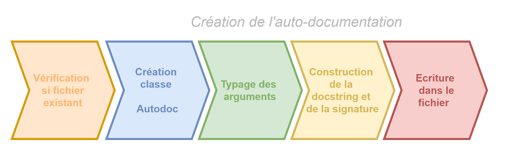

# Autodoc

Auto-documentation dynamique du code. Créé un fichier d'interface `.pyi` spécifiant le typage des fonctions décorée.

## Objets utilisés

Pour fonctionner, le module a besoin :

1. De la fonction à documenter. Via laquelle on peut avoir accès à la signature, le nom de la fonction, à la docstring, et au cadre (frame)
2. Le cadre permet de déterminer grand nombre de variables : le nom du fichier, le nom des arguments passés et de la variable retournée.
3. Des arguments. On utilise directement les valeurs des arguments passés à la fonction.
    - Dans le cas des arguments positionnels, on ne connait que leurs valeurs, mais pas leurs noms. Les arguments positionnels sont nécessairement passés dans le même ordre que dans la définition de la fonction. Ainsi, on peut utiliser la fonction `inspect.signature` pour déterminer les noms, ou bien la liste co_argnames qui est un attibut du cadre (`frame`). Il semble plus robuste d'utiliser la signature.
4. De la valeur du résultat retourné par la fonction. Ceci pour permettre de typer ce retour.
5. Du style de documentation souhaité. **Sera implémenté dans une v2**
6. D'un fichier de paramètres, pour par exemple spécifier le chemin vers lequel écrire les résultats. **Sera implémenté dans unen v2**

## Objets crées

Autodoc souhaite aussi donner des exemples des valeurs utilisées, ceci à l'aide de `reprlib.repr`, qui donne une représentation alternative, souvent simplifiée par des ellispes, des objets Python. Ceci pourrait être rendu optionnel.

Autodoc souhaite également pouvoir typer les structures de données contenaires récursivement. C'est-à-dire, pour un tuple de liste contenant des chaînes de caractère et des entiers par exemple, pouvoir typer : `tuple[list[str], list[int]]` plutôt que seulement `tuple`. A terme, on souhaiterait pouvoir spécifier la profondeur à laquelle effectuer le typage. **Sera implémenté dans une v2**

Finalement, grâce à la fonction `type` on peut savoir à quel module appartient une certaine classe. Si une classe n'est pas dans les `builtins`, on souhaiterait ajouter un import dans le fichier de sortie `.pyi`.

